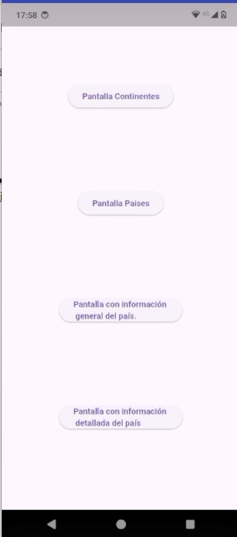
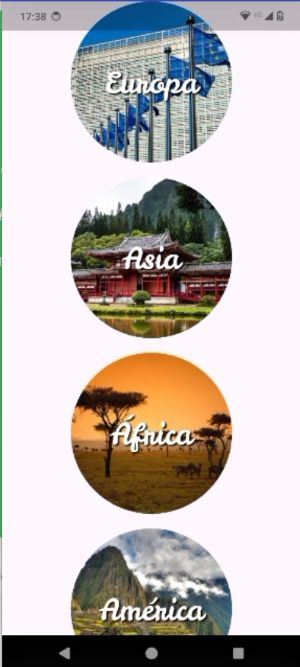
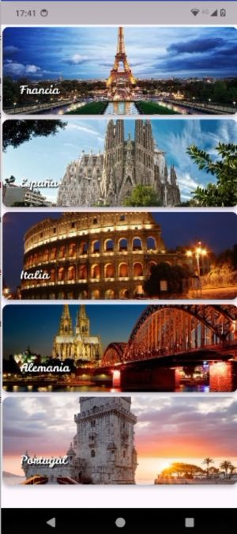
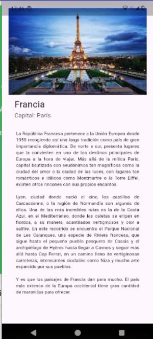
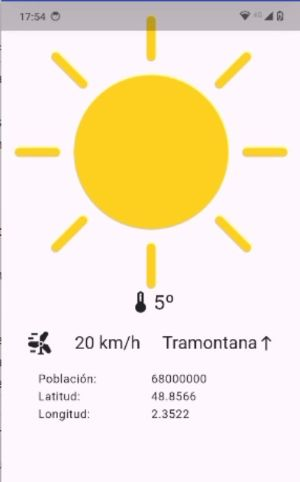

   

<a id="_apartado1"></a>

# Práctica 3. Widgets. 

Para esta práctica crearemos varias pantallas para una futura aplicación que proporcione información sobre los continentes y distintos países del mundo.

De momento, no añadiremos ninguna funcionalidad, solo el diseño de las pantallas para mostrar la información. Para ello se os proporcionará un proyecto de base (`paisesguiInicial`), en el que se encuentra parte de la implementación hecha, y tendréis que completar y realizar algunas de esas pantallas.

En este proyecto de base, dispongo de la clase `PaisesEjemplo` (fichero `lib/data/services/paises_ejemplo.dart`) que sería el equivalente a las peticiones api de la práctica 2, pero en este caso tenemos los datos en local, mediante unas funciones que nos devuelven esos datos en formato JSON.

La clase `PaisesRepository` (fichero `lib/data/repository/paises_repository.dart`) contendrá métodos que llaman al servicio y nos proporciona la información de continentes y países a mostrar (**en futuras tareas ya lo enlazaremos con la API**).

Este proyecto, además, ya tiene implementada una pantalla de inicio con cuatro botones para abrir las diferentes vistas:

<br>

### Pantalla inicial:



Como veis, tendremos una pantalla donde se muestran los continentes, otra para países, y un par más para información sobre un país.

Vuestra tarea será completar la implementación de estas cuatro vistas.

<br>

### Pantalla ContinentesScreen

Esta pantalla mostrará los cinco continentes haciendo uso del widget `CircleAvatar` con la imagen de cada continente y su nombre dentro. 

La vista final será la siguiente:



Esta pantalla se implementa en la clase `ContinentesScreen` (fichero `lib/ui/screens/continentes_screen.dart`), y hace uso del repositorio para obtener la lista de continentes, concretamente, de la función estática `PaisesRepository.getContinentes()`, que nos devuelve una lista de objetos de tipo `Continente`.

Como veréis en la clase, ya se os proporciona la mayor parte de la implementación, de manera que solo tendréis que implementar el método `build` del widget que representa cada continente (`ContinenteRoundButton`). 

El diseño general de la pantalla y la construcción de la lista de widgets, ya la tendréis creada. Echad un vistazo al resto de código y a los comentarios para entender bien su funcionamiento.

En esta clase, para simplificar, hemos incorporado el widget `ContinenteRoundButton` al mismo fichero fuente que la clase `ContinentesScreen`, pero podría perfectamente guardarse en un fichero externo, por ejemplo, ubicado en la carpeta `ui/widgets`.

<br>

### Pantalla Países

En esta pantalla se mostrará una lista de países, haciendo uso de Cards que combinan imagen y nombre del país:



 
Esta pantalla se implementa en la clase `PaisesScreen` (fichero `lib/ui/screens/paises_screen.dart`), y hace uso del repositorio para obtener la lista de objetos JSON con el nombre y la imagen de cada país de la lista. 

Concretamente, hace uso de la función estática `PaisesRepository.getPaises()`, que debéis implementar y que nos devolverá esta lista a modo de ejemplo para algunos países europeos.

Como veis, y de igual manera que en la pantalla anterior, habrá que generar un widget personalizado para generar una tarjeta, e instanciarlo con la información de cada país.

En el proyecto de base se os proporciona parte de la estructura, de manera que tendréis que completar los TO-DOs que aparecen. Se os da más información en el código.

<br>

### Pantallas con información sobre un país

Finalmente, generaremos dos pantallas con información sobre un país en concreto. De momento, este país será fijo, y lo obtendremos con el método `PaisesRepository.infoPais()` del repositorio.

En estas dos pantallas mostraremos la información del País que nos devuelve el método anterior: comarca, capital, poblacion, imagen representativa (img), descripción (desc), y latitud y longitud (vector coordenadas).

Además, también maquetaremos un espacio en una de ellas para añadir una imagen sobre el tiempo (de momento será fija), así como la temperatura actual y la dirección del viento (esta información la obtendremos también en tareas posteriores)

El aspecto de estas dos pantallas podrá ser parecido a las siguientes:
 
**Información básica sobre la comarca**



<br>

**Información ampliada sobre el país**



Las clases para generar estas pantallas son `InfoPaisGeneral` (fichero `lib/ui/screens/infopais_general.dart`) e `InfoPaisDetalle` (fichero `lib/ui/screens/infopais_detalle.dart`), respectivamente. 

Además, para la información detallada, se os proporciona un widget personalizado `MyWeatherInfo` (fichero `lib/ui/widgets/my_weather_info.dart`) para mostrar la información del clima en la comarca.

<br>

### Incluyendo los Assets

Tal y como se os proporciona el proyecto, no tenéis acceso a las tipografías o a las imágenes para representar el tiempo. Estos recursos se os proporcionan en la carpeta `assets`, pero hay que registrarlos en el fichero del proyecto `pubspec.yaml`. Modificad este fichero de manera que podáis hacer uso de estos recursos en vuestra aplicación.

<br>

### Estructura de la aplicación

Cuando empezamos a incorporar widgets a nuestras aplicaciones, es fácil que el código acabe considerablemente desordenado, y por eso es importante que procuremos llevar una organización lo más coherente y sencilla posible. 

Intentamos que nuestros widgets sean cortos y modulares, y que el código de la función `main` sea lo más simple posible.

El código que se os proporciona está dividido en varias carpetas, que posteriormente ampliaremos para seguir el patrón Provider. Si conocéis la arquitectura Modelo-Vista-Controlador, o Model-View-ViewModel, puede que os suenen algunas de estas capas o carpetas.

La organización del código es la siguiente:

```
.
├── assets
│   ├── fonts
│   │   └── ...
│   ├── icons
│   │   └── ...
│   └── img
│       └── ...
├── lib
│   ├── main.dart
│   ├── data
│   │   ├── 
│   │   ├── repository
│   │   │    └── paises_respository.dart
│   │   └── services 
│   │        └── paises_ejemplo.dart
│   ├── domain
│   │   └── entities
│   │       ├── continente.dart
│   │       └── pais.dart
│   ├── ui
│   │   ├── screens
│   │   │   ├── continentes_screen.dart
│   │   │   ├── infopais_detalle.dart
│   │   │   ├── infopais_general.dart
│   │   │   ├── launcher_screen.dart
│   │   │   └── paises_screen.dart
│   │   └──widgets
│           └── my_weather_info.dart
└── pubspec.yaml
```

Como vemos, tenemos:

- La carpeta `domain/entities` contiene los Modelos de nuestra aplicación, es decir, las clases `Continente` y `Pais`.
- La carpeta `data/repository` contiene la clase `PaisesRepository`, que nos servirá posteriormente como punto de acceso a los datos de la aplicación. De momento, el repositorio utiliza los datos locales que tenemos en `data/services/paises_ejemplo.dart`.
- La carpeta `ui/screens`, con las diferentes pantallas de la aplicación. 
- La carpeta `ui/widgets`, con widgets auxiliares que vamos a utilizar.

Después tenemos el fichero `main.dart`, con la función `main`, y la carpeta de `assets`, con los diferentes recursos.

<br>

### Entrega de la práctica

Para entregar la práctica recordad hacer `flutter clean` para eliminar todos los posibles build que se hayan construido y de esta forma hacer que el proyecto sea mucho menos pesado.

Se debe entregar además un **pequeño pdf** en el que se comenten las clases y widgets empleados para hacer las implementaciones nuevas solicitadas en la práctica con un apartado en el que se comenten las dificultades encontradas.

A continuación, comprimir la carpeta raíz junto con el pdf en un fichero .zip o .rar para hacer la entrega.

<br>

### Posibles mejoras a la práctica

// TODO
